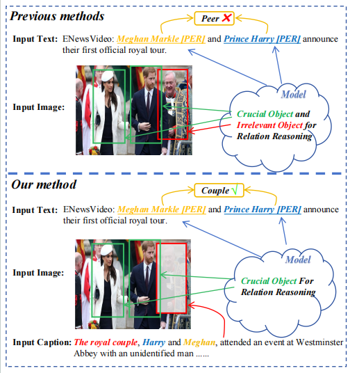
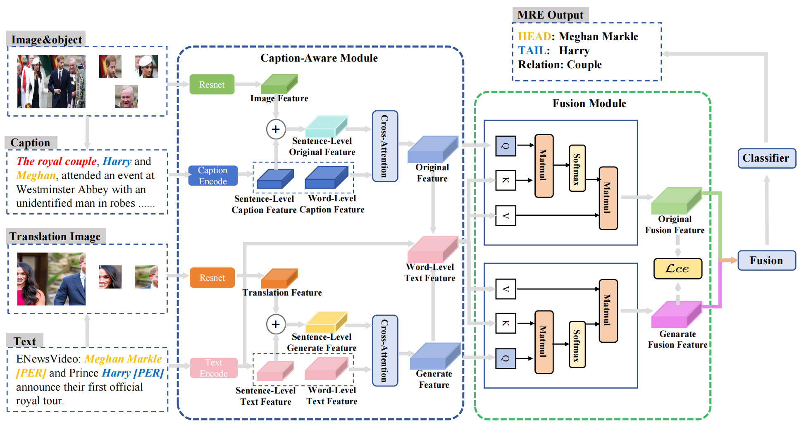

# Source Code of CAMIM for Multimodal Relation Extraction
Official Implementation of our Paper "Caption-Aware Multimodal Relation Extraction with Mutual Information Maximization" (Authors: Zefan Zhang, Weiqi Zhang, Yanhui Li, Bai Tian, indicates equal contribution) in ACM MM 2024.
## Motivation
 

Previous methods tend to introduce the issue of ***error sensitivity*** and be easily affected by ***irrelevant object information*** from the image, such as the person in the red box. Therefore, we try to leverage ***detailed captions of entities*** in a given image, which can eliminate the influence of irrelevant objects and improve the efficiency of relation extraction.
## Model Architecture
 

The framework of the proposed Caption-Aware MultiModal Relation Extraction Network with Mutual Information Maximization (CAMIM). (a) We utilize the Multimodal Large Language Model to extract captions and encode them by BERT, leverage ResNet50 to encode the image, and translation image \cite{rethinking} to get object-level features \cite{HVPChen}. (b) In the Caption-Aware Module, we hierarchically aggregate features from different levels and feed them into the Cross-attention Module to interact. To reduce the risk of overfitting, we feed outputs and text features together into the Fusion Module. (c) We finally leverage Mutual Information to preserve the crucial information.

## Required Environment
To run the codes, you need to install the requirements for [RE](requirements.txt).

    pip install -r requirements.txt

## Data Preparation
* MNRE
  
  You need to download three kinds of data to run the code.  
  > 1.The raw images of [MNRE](https://github.com/thecharm/MNRE), many thanks.  
  > 2.The visual objects from the raw images from [HVPNeT](https://github.com/zjunlp/HVPNeT), many thanks.  
  > 3.The generated images from [TMR](https://github.com/thecharm/TMR), many thanks.
  > 4.Our  generated [Captions]().
  
  Then you should put folders ``img_org``,  ``img_vg``,  ``diffusion_pic``,  ``caption``  under the "./data" path.

## Path Structure
The expected structures of Paths are:  
### Multimodal Relation Extraction
```
CAMIM
 |-- ckpt # save the checkpoint
 |-- data
 |    |-- txt  # text data
 |    |    |-- ours_train.txt # input data
 |    |    |-- ours_val.txt
 |    |    |-- ours_test.txt
 |    |    |-- mre_train_dict.pth  # {imgname: [object-image]}
 |    |    |-- ...
 |    |    |-- dif_train_weight_strong.txt  # strong correlation score for generated image
 |    |    |-- train_weight_strong.txt  # strong correlation score for original image
 |    |    |-- dif_train_weight_weak.txt  # weak correlation score for generated image
 |    |    |-- train_weight_weak.txt  # weak correlation score for original image
 |    |    |-- ...
 |    |    |-- phrase_text_train.json # {imgname: phrase for object detection}
 |    |    |-- ...
 |    |    |-- mre_dif_train_dif.pth # {imgname: [coordinates]}
 |    |    |-- ...
 |    |-- img_org       # original image data, please download it according to the above link
 |    |-- img_vg   # visual object image data for original image, please download it according to the above link
 |    |-- diffusion_pic   # generated image data, please download it according to the above link
 |    |-- caption   # Qwen caption data
 |    |    |-- BLIP_train.txt ... # BLIP caption data
 |    |    |-- caption_train.txt ... # Qwen caption data
 |    |    |-- cogvlm_train.txt ... # Cogvlm caption data
 |    |    |-- instruct_train.txt ... # Instruct-BLIP caption data
 |    |    |-- llavanext_train.txt ... # Llavanext caption data
 |    |    |-- minicpm_train.txt ... # minicpm caption data
 |    |-- ours_rel2id.json # target relations
 |-- opennre	# main framework 
 |    |-- encoder # main model
 |    |    |-- bert_encoder.py # TMR-RE
 |    |    |-- modeling_bert.py
 |    |-- framework # processing files
 |    |    |-- data_loader.py # data processor
 |    |    |-- sentence_re.py # trainer
 |    |    |-- utils.py
 |    |-- model # classifier
 |    |    |-- softmax_nn.py # main classifier
 |    |    |-- modeling_bert.py 
 |    |    |-- base_model.py # supporting the classifier, no modification required
 |    |-- tokenization # tokenizers, no modification required
 |    |-- pretrain.py # basic file
 |    |-- utils.py # basic file
 |-- opennre.egg-info
 |-- run.py   # main 
```
`bert_model.py` is the file for our CAMIM model.

`data_loader.py` is the file for processing raw data.

`sentence_re.py` is the file that sets up training, testing, and other processes.

`run.py` is used for running the whole program.

## Acknowledge
Sincerely thanks to [***HVPNeT***](https://github.com/zjunlp/HVPNeT) and [***TMR***](https://github.com/thecharm/TMR) for their contributions to this study. Undoubtedly, our success is inseparable from the efforts of any researcher who focuses on multimodal relation extraction tasks. Finally, we sincerely wish every researcher has wonderful scientific research!

## Citation

If you find this repo helpful, please cite the following:

``` latex
@inproceedings{DBLP:conf/mm/ZhangZL024,
  author       = {Zefan Zhang and
                  Weiqi Zhang and
                  Yanhui Li and
                  Tian Bai},
  editor       = {Jianfei Cai and
                  Mohan S. Kankanhalli and
                  Balakrishnan Prabhakaran and
                  Susanne Boll and
                  Ramanathan Subramanian and
                  Liang Zheng and
                  Vivek K. Singh and
                  Pablo C{\'{e}}sar and
                  Lexing Xie and
                  Dong Xu},
  title        = {Caption-Aware Multimodal Relation Extraction with Mutual Information
                  Maximization},
  booktitle    = {Proceedings of the 32nd {ACM} International Conference on Multimedia,
                  {MM} 2024, Melbourne, VIC, Australia, 28 October 2024 - 1 November
                  2024},
  pages        = {1148--1157},
  publisher    = {{ACM}},
  year         = {2024},
  url          = {https://doi.org/10.1145/3664647.3681219},
  doi          = {10.1145/3664647.3681219},
  timestamp    = {Wed, 06 Nov 2024 22:17:26 +0100},
  biburl       = {https://dblp.org/rec/conf/mm/ZhangZL024.bib},
  bibsource    = {dblp computer science bibliography, https://dblp.org}
}
```
